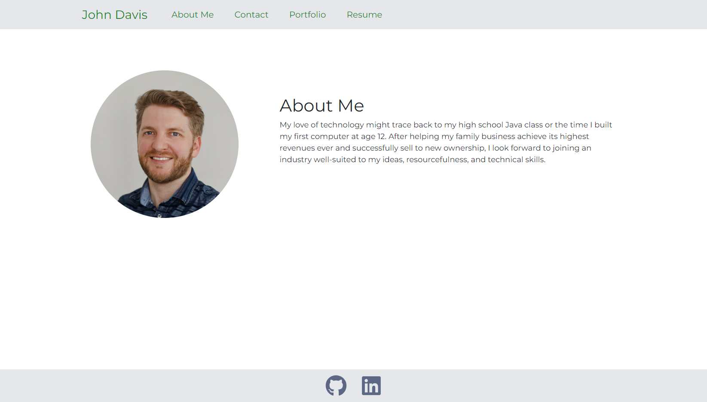
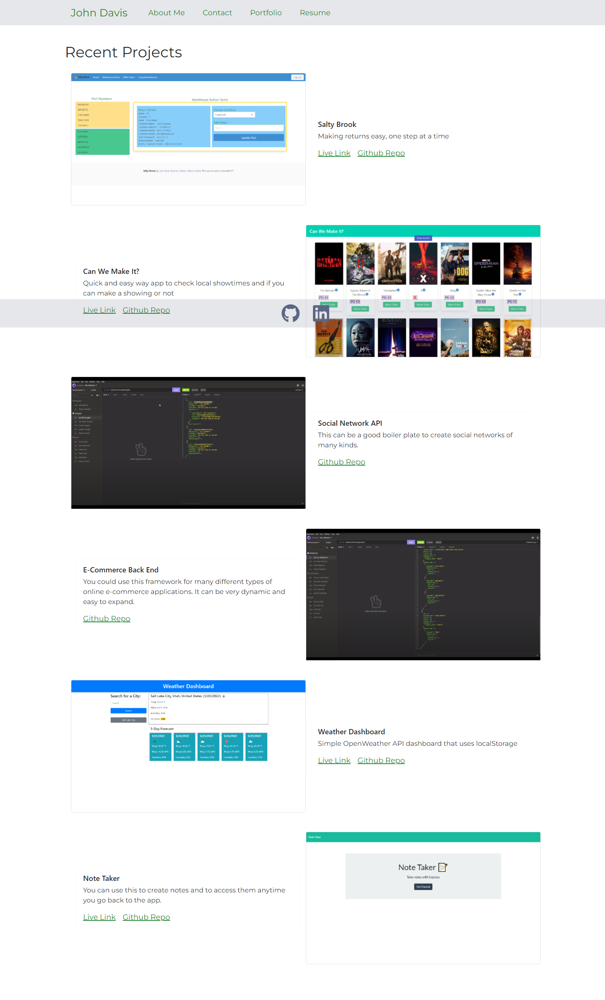
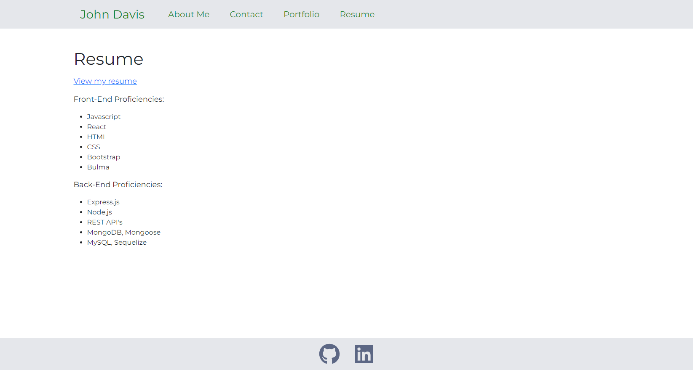

# John Davis Developer Profolio

This project was bootstrapped with [Create React App](https://github.com/facebook/create-react-app).

### Description 

This is my developer portfolio to show off some of the projects that I have created in my time at the University of Utah Web Development BootCamp. I was able to create this site using React and React Router and Bootstrap. I learned how to create a basic React app and how to use React Router to take care of the navigation side of things. I love how react works and I cannot wait to get much better and faster at creating react sites. I really do believe that its a better way to create websites, but it just entails a steep learning curve. I also decided to learn how to implement this site to AWS and get my own custom domain. That proccess went fairly smooth and I am proud to show this off.

## Table of Contents

  * [Installation](#installation)
  * [Usage](#usage)
  * [Credits](#credits)
  * [License](#license)
  * [Screenshots](#screenshots)
  * [Questions](#questions)

### Installation

[AWS Deployed Link](https://www.davisdeveloper.com/)

### Credits

Module 20 coursework and help from our awesome TA's! My brother Kevin helped with the design and color aspect of it and I used react-boostrap for the bones of the code.

### Screenshots

See the following images for a preview!

### License

Permission is hereby granted, free of charge, to any person obtaining a copy of this software and associated documentation files (the "Software"), to deal in the Software without restriction, including without limitation the rights to use, copy, modify, merge, publish, distribute, sublicense, and/or sell copies of the Software, and to permit persons to whom the Software is furnished to do so, subject to the following conditions:

The above copyright notice and this permission notice shall be included in all copies or substantial portions of the Software.

THE SOFTWARE IS PROVIDED "AS IS", WITHOUT WARRANTY OF ANY KIND, EXPRESS OR IMPLIED, INCLUDING BUT NOT LIMITED TO THE WARRANTIES OF MERCHANTABILITY, FITNESS FOR A PARTICULAR PURPOSE AND NONINFRINGEMENT. IN NO EVENT SHALL THE AUTHORS OR COPYRIGHT HOLDERS BE LIABLE FOR ANY CLAIM, DAMAGES OR OTHER LIABILITY, WHETHER IN AN ACTION OF CONTRACT, TORT OR OTHERWISE, ARISING FROM, OUT OF OR IN CONNECTION WITH THE SOFTWARE OR THE USE OR OTHER DEALINGS IN THE SOFTWARE.

### Questions?

[John Davis GitHub Account](https://github.com/johndavis92790/)
[John Davis Email](mailto:johndavis92790@gmail.com)